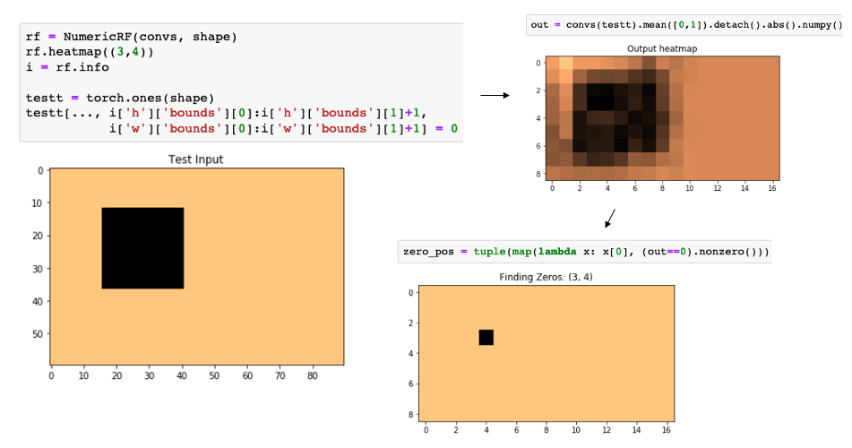

# simple Numerical Receptive Fields

<p align="center">

</p>


Analyzing the Receptive Field for a Convolutional Neural Network can be very useful in debugging and/or better understanding of how the model's output looked at the input. 

The RF can be mathematically derived (a good [blogpost on receptive field arithmetic](https://medium.com/mlreview/a-guide-to-receptive-field-arithmetic-for-convolutional-neural-networks-e0f514068807) and [this excellent distill.pub](https://distill.pub/2019/computing-receptive-fields/)). But we can also take advantage of [automatic differentiation](https://en.wikipedia.org/wiki/Automatic_differentiation) libraries to compute the RF numerically.

### Steps to compute RF

 1. Build the **dynamic computational graph** of the conv block
 2. Replace output gradients with all `0s`
 3. Pick a `(h, w)` position in this new gradient tensor and set it to `1s`
 4. **Backprop** this gradient through the graph
 5. Take the `.grad` of the input after the backward pass, and **look for non-zero entries**


(*) Effects of activation function on input gradient heatmap values??


## Usage

Can refer to the [demo notebook](https://github.com/ksanjeevan/simple-receptive-field/blob/master/demo.ipynb) or:


```python
import torch
from numeric_rf import NumericRF


input_shape = [1, 3, 60, 90]
convs = torch.nn.Sequential(
                                torch.nn.Conv2d(input_shape[1], 16, (5,3), stride=(3,2)),
                                torch.nn.Conv2d(16, 16, (5,3), stride=2),
                                torch.nn.Conv2d(16, 16, 3, padding=1),
                                torch.nn.Conv2d(16, 8, 3),
        )

rf = NumericRF(model       = convs,
 	       input_shape = input_shape)

rf.heatmap(pos = (4, 8))

rf.info()

rf.plot(add_text = True)

```
Will give the receptive field for that output position:

```
{
	'h': {
		'bounds' : (18, 58), 
		'range'  : 40}, 
		
	'w': {
		'bounds' : (28, 50), 
		'range'  : 22}
}
```

And then we can visualize:

<p align="center">

</p>


### Verification 

A quick way to verify that this approach works can be found in the [demo notebook](https://github.com/ksanjeevan/simple-receptive-field/blob/master/demo.ipynb), by following these steps:


 1. Calculate the receptive field for the conv block at a given position (important to zero out the bias term!)
 2. Create an input shaped tensor of `1s`
 3. Zero out all input entries that fall in the Receptive Field
 4. After a forward pass, the only zero entry should be the chosen position (other factors may contribute to zeros in the output, e.g. padding, but the initial output position **must** be `0`)

Illustrated here:

<p align="center">

</p>
