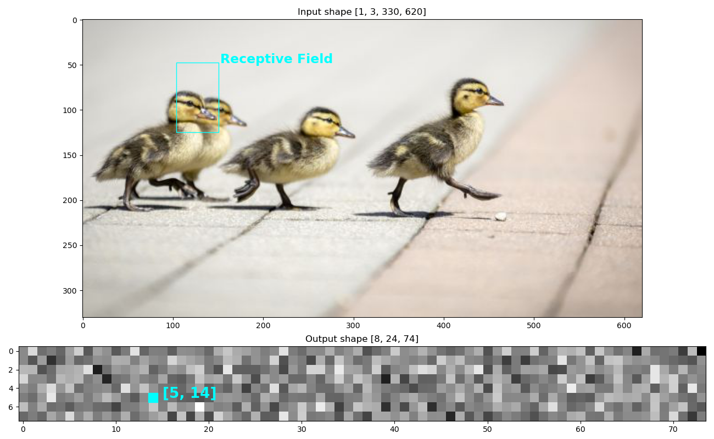

# simple Numerical Receptive Fields

<p align="center">

</p>


Analyzing the Receptive Field for Convolutional Neural Network can be very useful in debugging and/or better understanding of the model. The RF can be mathematically derived (a good [blogpost on receptive field arithmetic](https://medium.com/mlreview/a-guide-to-receptive-field-arithmetic-for-convolutional-neural-networks-e0f514068807) and [this excellent distill.pub](https://distill.pub/2019/computing-receptive-fields/).

We can also take advantage of [automatic differentiation](https://en.wikipedia.org/wiki/Automatic_differentiation) libraries to compute the RF numerically.

Steps:

 1. Build dynamic computational graph
 2. Replace output gradients with all `0s`
 3. Pick a (H, W) position in this new gradient and set it to `1s`
 4. Backprop this gradient through the graph
 5. Take the `.grad` of the input after the backward pass, and look for non-zero entries

## Usage

Can refer to the demo notebook or:


```python

import torch
from numericrf import NumericRF

shape = [1, 1, 60, 130]
convs = torch.nn.Sequential(
                                torch.nn.Conv2d(shape[1], 16, (7,1), stride=3),
                                torch.nn.Conv2d(16, 16, 5, padding=1),
                                torch.nn.Conv2d(16, 16, 3, padding=1),
                                torch.nn.Conv2d(16, 8, 3),
                                torch.nn.Conv2d(8, 1, 7),
        )

rf = NumericRF(convs, shape)

rf.heatmap(pos=(3, 10))

rf.info

rf.plot()

```
Will give the estimates of the receptive field for that output positions:

```
{
	'h': {
		'bounds': (3, 51), 
		'range': 48}, 
		
	'w': {
		'bounds': (24, 66), 
		'range': 42}
}
```

And then we can visualize:

<p align="center">

</p>